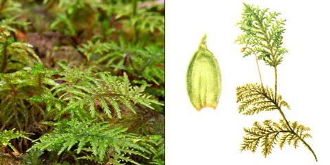

```{r setup, include=FALSE}
knitr::opts_chunk$set(echo = TRUE)
```
# SLA Analysis {.tabset .tabset-fade}
This is an R Markdown document. It contains both text and code with the purpose of allowing the user to follow the analysis exactly as done.

## Taking a look at SLA$_{\text{leaf}}$


```{r set_up, echo=FALSE, message=FALSE, warning=FALSE}
library("tidyverse")
library("broom")
library("readxl")
library("MASS")
library("plyr")
library("conover.test")
SLA <- read_excel("./forNathan_dataanalysis.xlsx")
growth <- c(rep("acro",20),rep("thal_liver",10), rep("acro",10),rep("fol_liver",10),
            rep("acro",10),rep("pleuro",3),rep("thal_liver",10),rep("acro",10),rep("thal_liver",10), rep("fol_liver",10),rep("acro",10),rep("pleuro",10),rep("acro",20),rep("pleuro",20))

SLA$growth <- growth
SLA <- SLA[!is.na(SLA$SLAleaf),]
SLA <- SLA %>% filter(growth != "thal_liver")

```

This is a plot of the SLA$_{\text{leaf}}$, which is the "correct"/gold standard functional measure of SLA. Note that the thallose liverworts have been removed from analysis since they are morphologically distinct from the rest of the collected bryophytes.

```{r first, echo=FALSE,fig.pos="H",fig.align='center'}
SLA %>% ggplot(aes(x = species, y = SLAleaf, color = growth)) + geom_point() +
  theme(panel.background = element_rect(fill = 'gray', colour = 'slateblue')) +
  theme(legend.title = element_text(colour="blue", size=16, face="bold"))
```

Here we see that the variation in SLA leaf doesn't appear to be constant for all bryophytes. Pleurocarpous mosses seem to have more variation overall than the other species, which may be explained by their large numbers of leaves, allowing for more measurement error to enter.


```{r second, echo=FALSE,fig.pos="H",fig.align='center'}
SLA %>% ggplot(aes(x = SLAleaf, fill = growth)) + geom_histogram(bins = 5, color = "blue") + facet_wrap(~species, scales = 'free') +
  theme(panel.background = element_rect(fill = 'gray', colour = 'slateblue')) +
  theme(legend.title = element_text(colour="blue", size=16, face="bold"))
```
Although the sample sizes are relatively low (n = 10 for the majority), the histograms of SLA leaf indicate that some of the distributions are likely non-normal (e.g. Tha_alo and Dip_alb appear to exhibit some right skew).

## Comparing SLA$_{\text{leaf}}$ and SLA$_{\text{shoot}}$

One of the key statements we'd like to make in the paper is that SLA$_{\text{shoot}}$ is an inadequate measure of SLA. My interpretation of this statement is that there isn't a reasonably simple way to predict the biologically relevant value of SLA$_{\text{leaf}}$ from the easier-to-obtain value of SLA$_{\text{shoot}}$. 

First we take a look at the relationship of the two quantities by plotting them against each other: 
```{r third, echo=FALSE,fig.pos="H", fig.align='center'}
SLA %>% filter(growth != "thal_liver") %>% ggplot(aes(y = SLAleaf, x = SLAshoot)) + geom_point() +
  
  theme(panel.background = element_rect(fill = 'gray', colour = 'slateblue')) +
  theme(legend.title = element_text(colour="blue", size=16, face="bold"))

```

There is certainly a positive relationship as would be expected between the two quantities, but nothing that would suggest a simple and reliable predictor. If the data are stratified by growth pattern:

```{r fourth, echo=FALSE,fig.pos="H", fig.align='center'}
SLA %>% filter(growth != "thal_liver") %>% ggplot(aes(y = SLAleaf, x = SLAshoot, color = growth)) + geom_point() +
  
  theme(panel.background = element_rect(fill = 'gray', colour = 'slateblue')) +
  theme(legend.title = element_text(colour="blue", size=16, face="bold"))

```

The groups appear to display distinct relationships and one may ask if, given the growth pattern of a particular bryophyte, it is possible to reasonably predict SLA$_{\text{leaf}}$. 

To this end, we fit a multiple regression model allowing each growth pattern group to have a distinct intercept and slope coefficient:
```{r naive_mul_reg, echo=TRUE, message=FALSE, warning=FALSE}
multiple_reg <- lm(SLAleaf ~ growth * SLAshoot, data = SLA)
summary(multiple_reg)
```
```{r naive_mul_reg_plot, echo=FALSE, message=FALSE, warning=FALSE, paged.print=FALSE,fig.pos="H", fig.align='center'}
SLA_nothal <- filter(SLA, growth != "thal_liver")

dd_m = data.frame(SLAshoot=SLA_nothal$SLAshoot, y=predict(multiple_reg, SLA_nothal), type=SLA_nothal$growth)

SLA %>% filter(growth != "thal_liver") %>% ggplot(aes(y = SLAleaf, x = SLAshoot, color = growth)) + geom_point() +
  
  geom_line(data=dd_m, aes(SLAshoot, y, colour=type))+
  
  theme(panel.background = element_rect(fill = 'gray', colour = 'slateblue')) +
  theme(legend.title = element_text(colour="blue", size=16, face="bold"))

```

A common way of checking the assumptions of a regression model is to look at the plot of residuals (i.e. difference between actual and fitted values) against the fitted values. The standard multiple regression model assumes that the error terms all come from a single normal distribution with mean 0 and constant variance and that the mean of the response is related in a linear way to the predictor. This would result in a band of residuals scattered around 0 with a constant width.

```{r echo=FALSE, message=FALSE, warning=FALSE, paged.print=FALSE, paged.print=FALSE,fig.pos="H", fig.align='center'}
multiple_reg %>% ggplot(aes(.fitted, .resid, color = growth)) +geom_point() +
  
  theme(panel.background = element_rect(fill = 'gray', colour = 'slateblue')) +
  theme(legend.title = element_text(colour="blue", size=16, face="bold"))

```

From this plot, one can conclude that the linear model is inadequate to describe the relationship between SLA$_{\text{shoot}}$ and SLA$_{\text{leaf}}$ for the acrocarpous mosses in general and that while it may be more appropriate for pleurocarpous and foliose liverworts, the assumption of constant variance is clearly violated. 

While it may be possible to use more complicated statistical models that allow for heteroskedasticity and non-linear relationships, we believe it is reasonable from the presented analysis that no reasonable ``simple" relationship exists between SLA$_{\text{shoot}}$ and SLA$_{\text{leaf}}$ such that one could predict SLA$_{\text{leaf}}$ with a high level of confidence from SLA$_{\text{shoot}}$.

### Why no formal test that SLA$_{\text{leaf}}$ and SLA$_{\text{shoot}}$ are different?

I think the differences between SLA$_{\text{leaf}}$ and SLA$_{\text{shoot}}$ are so apparent that a formal statistical test that the two are not identical is superfluous. SLA$_{\text{shoot}}$ is consistently smaller than SLA$_{\text{leaf}}$ and we have shown that a simple and accurate transformation between the two does not exist in general.

## Differences in SLA$_{\text{leaf}}$ between growth pattern groups

It may be of interest whether significant differences exist between the SLA$_{\text{leaf}}$ values of the 4 growth patterns:

```{r reload_with_thal, message=FALSE, warning=FALSE, include=FALSE, paged.print=FALSE,paged.print=FALSE,fig.pos="H", fig.align='center'}
SLA <- read_excel("./forNathan_dataanalysis.xlsx")
table(SLA$species)
growth <- c(rep("acro",20),rep("thal_liver",10), rep("acro",10),rep("fol_liver",10),
            rep("acro",10),rep("pleuro",3),rep("thal_liver",10),rep("acro",10),rep("thal_liver",10), rep("fol_liver",10),rep("acro",10),rep("pleuro",10),rep("acro",20),rep("pleuro",20))

SLA$growth <- growth
SLA <- SLA[!is.na(SLA$SLAleaf),]
```

```{r growth_boxplots, echo=FALSE, message=FALSE, warning=FALSE, paged.print=FALSE,paged.print=FALSE,fig.pos="H", fig.align='center'}
SLA %>% ggplot(aes(x= growth, y = SLAleaf, fill = growth)) + geom_boxplot() +
  theme(panel.background = element_rect(fill = 'gray', colour = 'slateblue')) +
  theme(legend.title = element_text(colour="blue", size=16, face="bold"))
```

```{r growth_histo, echo=FALSE, message=FALSE, warning=FALSE, paged.print=FALSE, paged.print=FALSE,paged.print=FALSE,fig.pos="H", fig.align='center'}
SLA %>% ggplot(aes(x = SLAleaf, fill = growth)) + geom_histogram(bins = 5) + facet_wrap(~growth, scales = 'free') +
  theme(panel.background = element_rect(fill = 'gray', colour = 'slateblue')) +
  theme(legend.title = element_text(colour="blue", size=16, face="bold"))
```

An informal look at the distributions seems to suggest that differences do indeed exist between the growth groups, but we might want to try to test for this formally somehow. A simple one-way ANOVA isn't going to be the ideal way of doing this however, since the data in the groups may not be normally distributed and the variances between the groups (especially for foliose liverworts) are very different from each other.

```{r growth_var, echo=TRUE, message=FALSE, warning=FALSE, paged.print=TRUE}
SLA %>% ddply(.(growth),summarize, variance =var(SLAleaf))
```

In this case the non-parametric Kruskal-Wallis Test results in a highly-significant p-value, indicating that these samples do not originate from identical distributions.

```{r kruskal, echo=TRUE, message=FALSE, warning=FALSE}
kruskal.test(SLAleaf~as.factor(growth), data = SLA)
```
To look at pairwise differences, we used the Conover-Iman Test, correcting for multiple testing with the Benjamini-Hochberg and Bonferroni methods:
```{r echo=TRUE, message=FALSE, warning=FALSE}
conover.test(SLA$SLAleaf, g = SLA$growth, method = "bh")
conover.test(SLA$SLAleaf, g = SLA$growth, method = "bonferroni")
```

While Benjamini-Hochberg rejects the null hypothesis for all pairwise comparisons, the more stringent Bonferroni correction only fails to reject the null for thallose liverworts and acrocarpous mosses. Again, it is wise to keep in mind that only 3 species of thallose liverworts were used and that it this result may not be respresentative of the broad growth class.

## Differences in SLA$_{\text{leaf}}$ within growth pattern groups

It may also be of interest whether a single SLA value can be used for each growth pattern:

### Acrocarpous
```{r acro, echo=FALSE, message=FALSE, warning=FALSE, paged.print=FALSE,paged.print=FALSE,fig.pos="H", fig.align='center'}
SLA %>% filter(growth == "acro") %>% ggplot(aes(x= species, y = SLAleaf, fill = species)) + geom_boxplot() +
  theme(panel.background = element_rect(fill = 'gray', colour = 'slateblue')) +
  theme(legend.title = element_text(colour="blue", size=16, face="bold"))
```

### Pleurocarpous
```{r pleuro, echo=FALSE, message=FALSE, warning=FALSE, paged.print=FALSE,paged.print=FALSE,fig.pos="H", fig.align='center'}
SLA %>% filter(growth == "pleuro") %>% ggplot(aes(x= species, y = SLAleaf, fill = species)) + geom_boxplot() +
  theme(panel.background = element_rect(fill = 'gray', colour = 'slateblue')) +
  theme(legend.title = element_text(colour="blue", size=16, face="bold"))
```

### Foliose Liverworts
```{r fol, echo=FALSE, message=FALSE, warning=FALSE, paged.print=FALSE,paged.print=FALSE,fig.pos="H", fig.align='center'}
SLA %>% filter(growth == "fol_liver") %>% ggplot(aes(x= species, y = SLAleaf, fill = species)) + geom_boxplot() +
  theme(panel.background = element_rect(fill = 'gray', colour = 'slateblue')) +
  theme(legend.title = element_text(colour="blue", size=16, face="bold"))
```

### Thalose Liverworts
```{r thal, echo=FALSE, message=FALSE, warning=FALSE, paged.print=FALSE,paged.print=FALSE,fig.pos="H", fig.align='center'}
SLA %>% filter(growth == "thal_liver") %>% ggplot(aes(x= species, y = SLAleaf, fill = species)) + geom_boxplot() +
  theme(panel.background = element_rect(fill = 'gray', colour = 'slateblue')) +
  theme(legend.title = element_text(colour="blue", size=16, face="bold"))
```

We believe it suffices to show that statistically significant differences exist between species within a growth group. The main message is that a single SLA value cannot represent an entire growth pattern. A visual inspection confirms that this is indeed the case for 3 of the 4 groups, with the exception of the 2 foliose liverworts. Again, we use the Kruskall-Wallis Test as a formal test:

```{r kruskall_multi, echo=TRUE, message=FALSE, warning=FALSE}
SLA %>% group_by(growth) %>% do(test = kruskal.test(SLAleaf~as.factor(species), data = .)) %>% glance(test)
```

Significant differences are observed for all growth groups with the exception of the 2 foliose liverworts. Again, only using 2 species severely limits the applicablity of this result to all foliose liverworts.

## Can we use a subset of the leaves to generate SLA$_{\text{leaf}}$?

Some bryophytes have many tiny leaves on the first 1cm of a shoot. This can make it quite time consuming to accurately measure SLA.

<center>



</center>


To this end, for a subset of the sample, an incomplete set of the leaves on the first 1cm of the shoot were used to calculate SLA. While a clearly defined method for choosing the number of leaves to use (for example based on a classification system of the number of leaves typically found on the first 1cm - "low"/"medium"/"high") is essential for the validity of the conclusions of the following analysis, we assume that the method employed here fulfills that criterium.

### Is SLA$_{\text{leaf}}$ =  SLA$_{\text{subsetleaf}}$?

The natural first question is whether or not we can just use the SLA value obtained from a subset of the leaves instead of the value that would be obtained from using all of the leaves.

One of the key assumptions of the paired t-test is a normal distribution of the differences of the two variables:

```{r diff_dist, echo=FALSE, message=FALSE, warning=FALSE, paged.print=FALSE,fig.pos="H", fig.align='center'}
SLA_sub <- SLA[which(!is.na(SLA$SLAsubset_leaf)),]
SLA_sub %>% ggplot() + geom_histogram(aes(x=SLAleaf - SLAsubset_leaf, y=..density..), bins = 10,
                                      color = "black", fill = "blue") + 
  stat_function(fun = dnorm, args = list(mean = mean(SLA_sub$SLAleaf-SLA_sub$SLAsubset_leaf),sd = sd(SLA_sub$SLAleaf-SLA_sub$SLAsubset_leaf) )) +
  theme(panel.background = element_rect(fill = 'gray', colour = 'slateblue')) +
  theme(legend.title = element_text(colour="blue", size=10, face="bold"))

```

Although the differences do appear visually to be approximately normally distributed, a Wilcoxon-signed rank test was also applied as a more conservative non-parametric test:

```{r overall_diff_tests, echo=TRUE, message=FALSE, warning=FALSE, paged.print=FALSE}
t.test(SLA_sub$SLAleaf, SLA_sub$SLAsubset_leaf, paired = TRUE )
wilcox.test(SLA_sub$SLAleaf, SLA_sub$SLAsubset_leaf, paired = TRUE)
```

We conclude that there is reasonable evidence that it is not generally the case that SLA$_{\text{leaf}}$ =  SLA$_{\text{subsetleaf}}$.

### Are there any particular growth groups for which this holds?

Even though it may not be generally true, it would still be very useful if SLA$_{\text{leaf}}$ =  SLA$_{\text{subsetleaf}}$ were to hold for some growth patterns. Taking a look at the distributions of the differences for each group:

```{r growth_histog, echo=FALSE, fig.align='center', fig.pos="H", message=FALSE, warning=FALSE, paged.print=FALSE}
SLA_sub %>% ggplot() + geom_histogram(aes(x=SLAleaf - SLAsubset_leaf, y=..density..), bins = 10,
                                      color = "black", fill = "blue") + 
  facet_wrap(~growth)+
  theme(panel.background = element_rect(fill = 'gray', colour = 'slateblue')) +
  theme(legend.title = element_text(colour="blue", size=10, face="bold")) 

```

It is difficult to determine how well these distributions approximate a normal curve. Therefore we applied the Wilcoxon-signed rank test to each of the 3 growth pattern groups individually:

```{r growth_tests, echo=TRUE, message=FALSE, paged.print=FALSE,fig.pos="H", fig.align='center'}
wilcox.test(SLA_sub$SLAleaf[(SLA_sub$growth == "acro")], SLA_sub$SLAsubset_leaf[(SLA_sub$growth == "acro")], paired = TRUE)

wilcox.test(SLA_sub$SLAleaf[(SLA_sub$growth == "pleuro")], SLA_sub$SLAsubset_leaf[(SLA_sub$growth == "pleuro")], paired = TRUE)

wilcox.test(SLA_sub$SLAleaf[(SLA_sub$growth == "fol_liver")], SLA_sub$SLAsubset_leaf[(SLA_sub$growth == "fol_liver")], paired = TRUE)
```

Before adjusting for multiple testing, each of these tests indicates nominal evidence that SLA$_{\text{leaf}}$ and SLA$_{\text{subsetleaf}}$ are not generally interchangeable within each growth group. 

Note: in the course of the test for pleurocarpous mosses, it was found that a sample of Pleurozium schreberi had identical values for SLA$_{\text{leaf}}$ and SLA$_{\text{subsetleaf}}$, a very unlikely event that suggests a potential data entry error.

### Is there a reasonably simple way to predict SLA$_{\text{leaf}}$ from SLA$_{\text{subsetleaf}}$?

If SLA$_{\text{subsetleaf}}$ can be used to accurately predict SLA$_{\text{leaf}}$, it still may be desirable to save resources and time by only collecting the first.

```{r subset_leaf_plot, echo=FALSE, message=FALSE, warning=FALSE, paged.print=FALSE,fig.pos="H", fig.align='center'}
SLA_sub %>% ggplot(aes(x= SLAsubset_leaf, y = SLAleaf, color = growth)) + geom_point() +
  theme(panel.background = element_rect(fill = 'gray', colour = 'slateblue')) +
  theme(legend.title = element_text(colour="blue", size=10, face="bold")) 
```

It appears that applying logarithmic transformations may improve the assumptions of the linear model:

```{r log_plot, echo=FALSE, message=FALSE, warning=FALSE, paged.print=FALSE,fig.pos="H", fig.align='center'}
SLA_sub %>% ggplot(aes(x= log(SLAsubset_leaf), y = log(SLAleaf))) + geom_point(aes(color = growth))+ geom_smooth(method="lm")+
  theme(panel.background = element_rect(fill = 'gray', colour = 'slateblue')) +
  theme(legend.title = element_text(colour="blue", size=10, face="bold"))    

```

Taking a look at the residuals v.s. the fitted values:

```{r log_model_resid, echo=FALSE, message=FALSE, warning=FALSE, paged.print=FALSE,fig.pos="H", fig.align='center'}
subset_lm <- lm(log(SLAleaf)~log(SLAsubset_leaf), data = SLA_sub)

subset_lm %>% ggplot(aes(.fitted, .resid)) + geom_point(aes(color = SLA_sub$growth)) +
  
  theme(panel.background = element_rect(fill = 'gray', colour = 'slateblue')) +
  theme(legend.title = element_text(colour="blue", size=10, face="bold"))

```
we can identify potentially problematic patterns (a "w" shape in residuals, distinct patterns within growth groups). We can nonetheless get an idea of the predictive accuracy of this simple linear model as follows:

* Randomly remove approximately 20$%$ of the dataset as a test set (i.e. ~20$%$ of each species removed)
* Train the linear model on the remaining data
* Generate predictions for the test set
* Calculate Root Mean Squared Error

```{r RMSE, echo=FALSE, message=FALSE, warning=FALSE, paged.print=FALSE,fig.pos="H", fig.align='center'}
SLA_sub$id <- seq(1:nrow(SLA_sub))
set.seed(09092018)
SLA_10 <- SLA_sub %>% filter((species != "Aul_pal") & (species != "Hyl_spl")) %>% group_by(species) %>% sample_n(size = 8)
SLA_aul <- SLA_sub %>% filter(species == "Aul_pal") %>% sample_n(6)
SLA_hyl <- SLA_sub %>% filter(species == "Hyl_spl") %>% sample_n(1)

SLA_subtrain <- bind_rows(SLA_10, SLA_aul)
SLA_subtrain <- bind_rows(SLA_subtrain, SLA_hyl)
SLA_subtrain <- filter(SLA_subtrain, growth != "thal_liver")

SLA_ids <- SLA_subtrain$id
SLA_subtest <- SLA_sub %>% filter(!id %in% SLA_ids) %>% filter( growth != "thal_liver")

subset80_lm <- lm(log(SLAleaf)~log(SLAsubset_leaf), data = SLA_subtrain)

######################################################
SLA_nothal <- filter(SLA_sub, growth != "thal_liver")

dd_m <- data.frame(log_SLAsubleaf=log(SLA_nothal$SLAsubset_leaf), y=predict(subset80_lm, SLA_nothal), type=SLA_nothal$growth)

SLA_subtest %>% filter(growth != "thal_liver") %>% ggplot(aes(y = log(SLAleaf), x = log(SLAsubset_leaf), color = growth)) + geom_point() +
  
  geom_line(data=dd_m, aes(log_SLAsubleaf, y, colour=type))+
  
  theme(panel.background = element_rect(fill = 'gray', colour = 'slateblue')) +
  theme(legend.title = element_text(colour="blue", size=16, face="bold"))

```
The points above are the testing dataset and the line is linear model fitted on the training dataset.

```{r RMSE_calc, echo=TRUE, message=FALSE, warning=FALSE, paged.print=FALSE}
RMSE <- sqrt((sum((exp(predict(subset80_lm, SLA_subtest)) -(SLA_subtest$SLAleaf))^2))/nrow(SLA_subtest))
```

The RMSE for this partition of the dataset is approximately 20.6. With the potential systematic prediction errors by growth group in mind, it is also a question for the bryophyte specialist whether an "average" prediction error of this magnitude could be tolerated in applications of SLA. 

## Is SLA calculated from the first 2cm equal to that from the first 1 cm?

I'm not really certain why this is of great utility. Maybe it is biologically interesting or maybe for some species it is easier to take 2 cm instead of 1 cm? The following analysis will be almost identical to the above analysis for SLA$_{\text{subsetleaf}}$, but I've included the thallose liverworts again.

```{r two_diff_hist, echo=FALSE, message=FALSE, warning=FALSE, paged.print=FALSE,fig.pos="H", fig.align='center'}

SLA2<- SLA[which(!is.na(SLA$SLA2cmleaf)),]

SLA2 %>% ggplot() + geom_histogram(aes(x=SLAleaf - SLA2cmleaf, y=..density..), bins = 10,
                                      color = "black", fill = "blue") + 
  stat_function(fun = dnorm, args = list(mean = mean(SLA2$SLAleaf-SLA2$SLA2cmleaf),sd = sd(SLA2$SLAleaf-SLA2$SLA2cmleaf) )) +
  theme(panel.background = element_rect(fill = 'gray', colour = 'slateblue')) +
  theme(legend.title = element_text(colour="blue", size=10, face="bold")) 

```

While the distribution of the differences is perhaps appropriate for a matched t-test, again, a Wilcoxon signed rank test was also applied:

```{r over2_diff_tests, echo=TRUE, message=FALSE, warning=FALSE, paged.print=FALSE}
t.test(SLA2$SLA2cmleaf, SLA2$SLAleaf, paired = TRUE )
wilcox.test(SLA2$SLAleaf, SLA2$SLA2cmleaf, paired = TRUE)
```

While in general, there appear to be differences between the SLA values for 1 and 2 cm shoots, when stratified by growth pattern:

```{r two_diff_hist_growth, echo=FALSE, message=FALSE, warning=FALSE, paged.print=FALSE,fig.pos="H", fig.align='center'}

SLA2 %>% ggplot() + geom_histogram(aes(x=SLAleaf - SLA2cmleaf, y=..density..), bins = 10,
                                      color = "black", fill = "blue") + facet_wrap(~growth) +
  theme(panel.background = element_rect(fill = 'gray', colour = 'slateblue')) +
  theme(legend.title = element_text(colour="blue", size=10, face="bold")) 

```

```{r growth_2cm_diff_tests, echo=TRUE, message=FALSE, warning=FALSE, paged.print=FALSE}
t.test(SLA2$SLAleaf[(SLA2$growth == "acro")], SLA2$SLA2cmleaf[(SLA2$growth == "acro")], paired = TRUE)

wilcox.test(SLA2$SLAleaf[(SLA2$growth == "pleuro")], SLA2$SLA2cmleaf[(SLA2$growth == "pleuro")], paired = TRUE)

wilcox.test(SLA2$SLAleaf[(SLA2$growth == "fol_liver")], SLA2$SLA2cmleaf[(SLA2$growth == "fol_liver")], paired = TRUE)

wilcox.test(SLA2$SLAleaf[(SLA2$growth == "thal_liver")], SLA2$SLA2cmleaf[(SLA2$growth == "thal_liver")], paired = TRUE)
```

We find that the SLA values from 2 cm shoots do not show significant differences for the mosses, but that the liverworts both have nominally significant results. This is maybe a consequence of their contrasting morphologies.

Note that a matched pair t-test was used for acrocarpous mosses based on the reasonable normal-looking distribution of differences.
